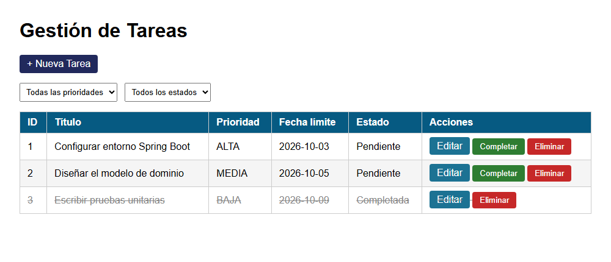
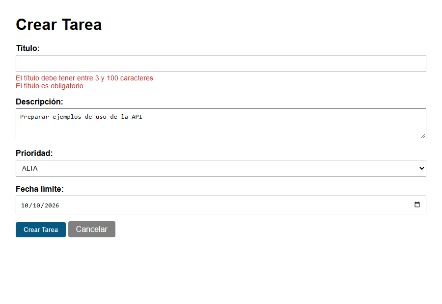
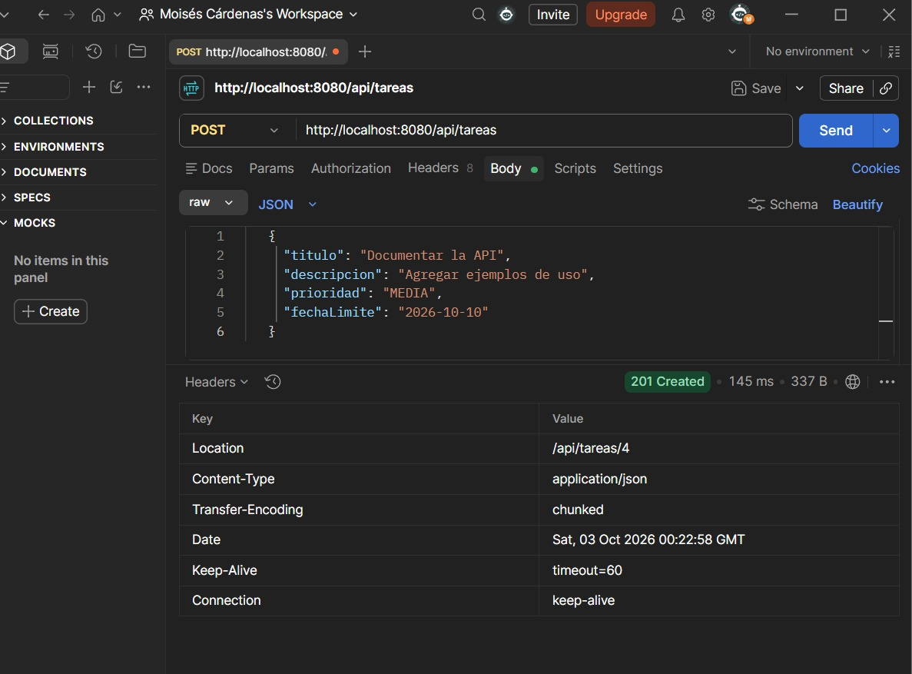
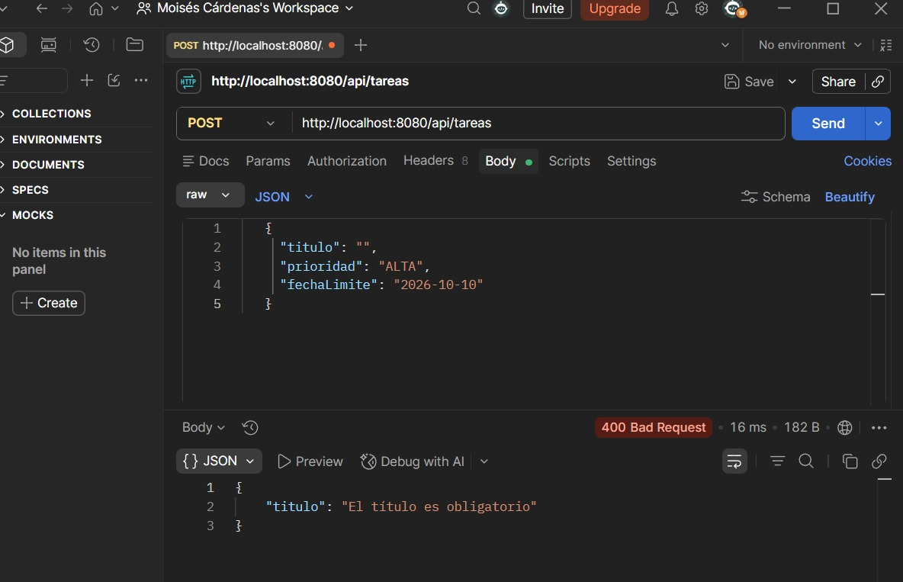
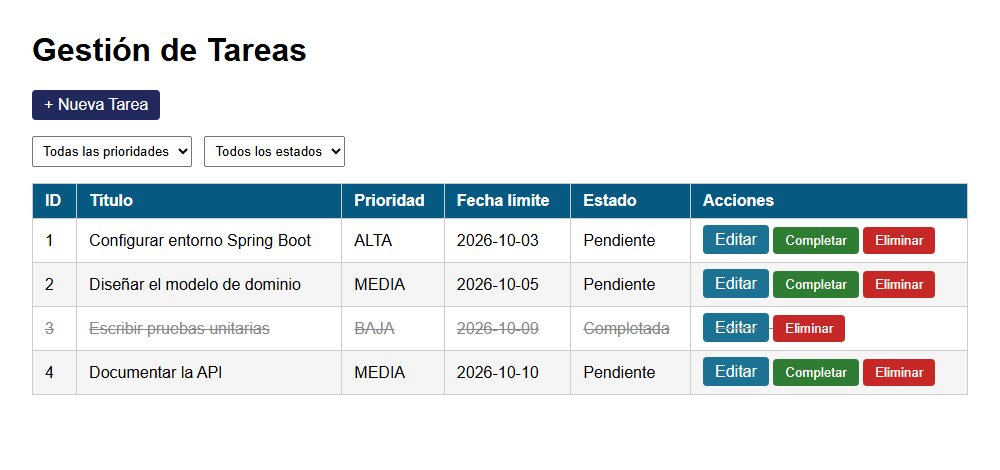
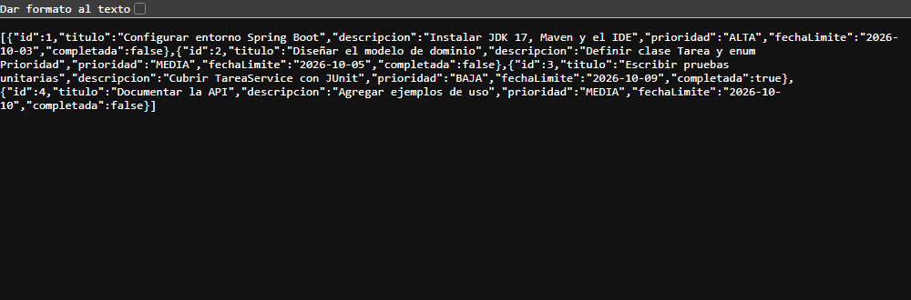

# Post-contenido — Unidad 7: Gestión de Tareas con Spring Boot

## Descripción
Repositorio del laboratorio de la Unidad 7 de Programación Web — Séptimo
Semestre. Un único proyecto Spring Boot con dos capas sobre el mismo
TareaService: una vista Thymeleaf (@Controller, parte 1) y una API REST
(@RestController, parte 2).

## Prerrequisitos
- JDK 17 o superior en el PATH
- Maven 3.8+ (o el wrapper `mvnw` incluido en el repositorio)
- IntelliJ IDEA o VS Code con Extension Pack for Java
- Postman o curl para probar la API

**Tecnologías:** Spring Boot 3.2.12 (Spring Web, Thymeleaf, Validation, DevTools), Java 17.

## Estructura del proyecto
```
cardenas-post1-u7/
├── pom.xml
├── mvnw, mvnw.cmd, .mvn/               ← wrapper de Maven
├── README.md
├── capturas/
└── src/main/
    ├── java/com/universidad/tareas/
    │   ├── TareasApplication.java
    │   ├── model/
    │   │   ├── Prioridad.java           ← enum ALTA, MEDIA, BAJA
    │   │   └── Tarea.java               ← modelo con Bean Validation
    │   ├── service/
    │   │   └── TareaService.java        ← repositorio en memoria (singleton)
    │   └── controller/
    │       ├── TareaController.java     ← vista Thymeleaf (parte 1)
    │       ├── TareaApiController.java  ← API REST (parte 2)
    │       └── ApiErrorHandler.java     ← errores de validación en JSON (parte 2)
    └── resources/
        ├── application.properties
        └── templates/tareas/
            ├── lista.html
            └── formulario.html
```

## Parte 1 — Vista Thymeleaf con @Controller
TareaController expone /tareas con filtrado por @RequestParam (prioridad,
completada), formularios validados con @Valid + BindingResult, y las
acciones completar/eliminar implementadas como POST (no GET) para no
introducir efectos secundarios en peticiones de solo lectura.

| Método | URL | Descripción |
|---|---|---|
| GET | `/tareas?prioridad=&completada=` | Lista de tareas, filtrable por prioridad y/o estado |
| GET | `/tareas/nueva` | Formulario de creación |
| GET | `/tareas/{id}/editar` | Formulario de edición prellenado |
| POST | `/tareas/guardar` | Crea o actualiza; si falla la validación vuelve al formulario con los errores, si no redirige a `/tareas` (PRG) |
| POST | `/tareas/{id}/completar` | Marca la tarea como completada y redirige (PRG) |
| POST | `/tareas/{id}/eliminar` | Elimina la tarea y redirige (PRG) |

## Parte 2 — API REST con @RestController
TareaApiController expone /api/tareas con los verbos GET, POST, PUT,
PATCH y DELETE, inyectando por constructor la MISMA instancia de
TareaService que usa la Parte 1. ApiErrorHandler traduce los errores de
@Valid en JSON estructurado (400 Bad Request), en lugar de la pantalla
de error HTML por defecto de Spring Boot.

### Tabla de endpoints de la API
| Método | URL | Código éxito | Código error | Descripción |
|---|---|---|---|---|
| GET | `/api/tareas` | 200 OK | — | Lista de tareas en JSON, filtrable con `?prioridad=` y/o `?completada=` |
| GET | `/api/tareas/{id}` | 200 OK | 404 Not Found | Retorna la tarea con el ID indicado |
| POST | `/api/tareas` | 201 Created | 400 Bad Request | Crea una tarea con el JSON del body (header `Location`) |
| PUT | `/api/tareas/{id}` | 200 OK | 404 / 400 | Reemplaza todos los campos de la tarea existente |
| PATCH | `/api/tareas/{id}/completar` | 200 OK | 404 Not Found | Actualización parcial: marca únicamente `completada = true` |
| DELETE | `/api/tareas/{id}` | 204 No Content | 404 Not Found | Elimina la tarea con el ID indicado |

### Ejemplos con curl
```bash
# Listar con filtro
curl "http://localhost:8080/api/tareas?prioridad=ALTA&completada=false"

# Crear (201 Created + Location)
curl -X POST http://localhost:8080/api/tareas \
  -H "Content-Type: application/json" \
  -d '{"titulo":"Documentar la API","descripcion":"Agregar ejemplos de uso","prioridad":"MEDIA","fechaLimite":"2026-10-10"}'

# Crear inválida (400 Bad Request → {"titulo":"El título es obligatorio"})
curl -X POST http://localhost:8080/api/tareas \
  -H "Content-Type: application/json" \
  -d '{"titulo":"","prioridad":"ALTA","fechaLimite":"2026-10-10"}'

# Completar (PATCH) y eliminar (DELETE → 204)
curl -X PATCH http://localhost:8080/api/tareas/4/completar
curl -X DELETE http://localhost:8080/api/tareas/4 -i
```

## Decisiones de diseño
- Inyección por constructor (no @Autowired en campo) en ambos
  controladores: mejora la testabilidad y hace explícita la dependencia.
- TareaService es un @Service singleton: TareaController y
  TareaApiController reciben la misma instancia, por lo que la vista y la
  API leen y escriben exactamente los mismos datos en memoria.
- Las anotaciones de Bean Validation están en el modelo Tarea, compartido
  por las dos capas, para no duplicar las reglas.
- @FutureOrPresent en lugar de @Future en fechaLimite: permite tareas
  con vencimiento el mismo día de su creación.
- @DateTimeFormat(iso = ISO.DATE) en fechaLimite: `<input type="date">`
  exige el formato yyyy-MM-dd; sin esta anotación Thymeleaf escribía la
  fecha según el locale (ej. 5/10/26) y el campo aparecía vacío al editar
  una tarea o al volver al formulario con errores.
- POST (no GET) para completar/eliminar en TareaController: una petición
  GET debe ser segura y no debe modificar estado del servidor.
- Patrón Post/Redirect/Get en todas las operaciones de la vista que
  modifican estado, para que recargar la página (F5) no repita la acción.
- PATCH (no PUT) para /api/tareas/{id}/completar: representa una
  actualización parcial de un único campo, no el reemplazo del recurso.
- Manejo de validación separado por capa: BindingResult para la vista
  HTML, @RestControllerAdvice para la API JSON — cada una responde en el
  formato que le corresponde. Cuando un campo viola varias reglas a la vez
  (un título vacío incumple @NotBlank y @Size), la API prioriza el mensaje
  de campo obligatorio.
- Persistencia en memoria (Map en TareaService) en lugar de JPA/Hibernate:
  la persistencia real se introduce formalmente en la Unidad 8.

## Cómo compilar y ejecutar
1. Clonar el repositorio: `git clone https://github.com/Moisex006/cardenas-post1-u7.git`
2. Abrir la carpeta como proyecto Maven en IntelliJ IDEA
3. Ejecutar `mvn spring-boot:run` (o `./mvnw spring-boot:run`)
4. Vista web: http://localhost:8080/tareas
   API REST: http://localhost:8080/api/tareas (probar con Postman o curl)

## Capturas de pantalla

### Parte 1 — Vista web
Lista de tareas con los filtros de prioridad y estado:



Formulario con error de validación (los demás datos se conservan):



### Parte 2 — API REST
POST válido: 201 Created con header `Location: /api/tareas/4`:



POST con título vacío: 400 Bad Request con errores en JSON:



### Datos compartidos entre la vista y la API
La tarea "Documentar la API", creada desde Postman, aparece en la vista web
y en `GET /api/tareas`, porque ambas capas usan la misma instancia de TareaService:




